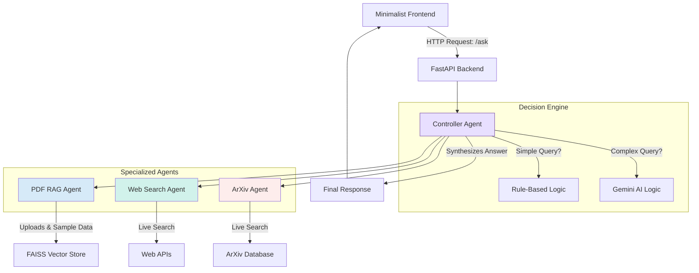

# Technical Report: Multi-Agentic System with Dynamic Decision Making

**Applicant:** [Your Name]  
**Date:** 2025-10-07  
**For:** Solar Industries India Limited - AIML Internship Assessment

---

### 1. Executive Summary

This project implements a multi-agent AI system that routes user queries to specialized agents based on query characteristics. The system consists of a FastAPI backend, a minimalist frontend interface, and three agents: a PDF RAG agent, a web search agent, and an ArXiv agent for academic papers.

The primary contribution is a hybrid controller that uses rule-based matching for common queries and escalates to a Gemini model for complex requests. This design balances response latency with routing accuracy while minimizing API costs. The system includes comprehensive logging, robust error handling, and domain-specific sample data relevant to Solar Industries.

### 2. System Architecture

The architecture is modular. User requests from the frontend are handled by the FastAPI backend, which delegates query processing to the Controller Agent. The controller then determines which agents to invoke, collects their responses, and synthesizes a unified answer.

### 3. Controller Logic

The ControllerAgent implements a two-tier routing strategy:

*   **Rule-Based Routing:** For straightforward queries, keyword matching provides immediate routing decisions. For example, a query containing "latest news" invokes the Web Search agent, while "research paper" triggers the ArXiv agent. This path executes in milliseconds.

*   **LLM-Assisted Routing:** For complex queries like "What are the latest market trends and academic papers on perovskite solar cells?" the controller escalates to the Gemini language model. It uses a prompt instructing the LLM to act as a router, returning a JSON specification such as `{"agents": ["Web Search", "ArXiv"]}`. The controller then invokes both agents accordingly.

This hybrid approach provides efficiency for routine requests while maintaining intelligent routing for ambiguous cases. All agents expose a uniform interface (`search()` or `retrieve()`) to facilitate future extensibility.

### 4. Development Challenges & Solutions

This section outlines key challenges faced during development and the solutions implemented.

*   **Challenge: Incorrect RAG Prioritization**
    *   **Problem:** The RAG agent initially returned results from sample PDFs instead of more relevant, recently uploaded user documents.
    *   **Solution:** I implemented a timestamp-based re-ranking algorithm. This gives a "boost" to documents based on upload recency, ensuring user-provided content is prioritized over general-purpose samples.

*   **Challenge: Simplistic Controller Logic**
    *   **Problem:** An early rule-based controller could not handle multi-faceted queries that required invoking more than one agent.
    *   **Solution:** I designed a hybrid controller that uses rules for simple queries and escalates to a Gemini LLM for complex ones. This allows the system to handle nuanced requests while remaining efficient.

*   **Challenge: System Fragility**
    *   **Problem:** The application would crash if an external API call failed.
    *   **Solution:** I wrapped all external API calls in `try...except` blocks with graceful fallbacks (e.g., DuckDuckGo for web search). The system now logs the error and continues to function with data from the remaining agents.

### 5. Design Decisions

*   **Vector Store:** I chose FAISS for its high performance and minimal dependency footprint, which was ideal for a self-contained project where in-memory speed was prioritized over persistence.

*   **Embedding Model:** The `all-MiniLM-L6-v2` model was selected for its balance of performance and small size (~90 MB), simplifying deployment.

*   **PDF Parsing:** PyMuPDF was used for its superior speed and accuracy in text extraction compared to other open-source alternatives.

### 6. Sample Data Generation

The system programmatically generates five sample PDFs on initial startup: three on general AI topics (RAG, multi-agent systems) and two with Solar Industries-specific context (company overview, AI/ML applications in explosives manufacturing). This dual approach demonstrates both the system's general capabilities and its relevance to the company's domain.

### 7. Security and Privacy

*   **PDF Handling:** Uploaded files are validated by type and size (max 10MB) and deleted immediately after ingestion into the vector store.
*   **Data Retention:** An automated cleanup task on startup removes any uploaded files older than 24 hours.
*   **API Keys:** Keys are loaded from a `.env` file and are not hard-coded. This file is excluded from version control.

### 8. Limitations & Known Issues

-   **No Vector Store Persistence:** The FAISS index is in-memory and rebuilt on every restart, so uploaded PDFs are not persisted.
-   **Single-User Design:** The system is not multi-tenant; all users share the same vector store.
-   **Sequential Agent Calls:** Agent invocations are sequential, not parallel. Using `asyncio.gather()` would reduce latency for multi-agent queries.
-   **Text-Only PDFs:** The system does not support scanned documents or images within PDFs, which would require OCR.
-   **English-Only:** The model is optimized for English and would require a multilingual embedding model to support other languages.

### 9. Future Enhancements

For a production deployment at Solar Industries, I would recommend the following enhancements:

*   **Domain-Specific Fine-Tuning:** Fine-tune the embedding model on Solar Industries' internal technical documents to improve retrieval accuracy for domain-specific terminology.
*   **Real-time Response Streaming:** Modify the backend and frontend to stream responses token-by-token, improving perceived responsiveness.
*   **Cost & Token Tracking:** Implement logic to capture token usage from the Gemini API to monitor and budget for LLM costs.
*   **Vector Store Persistence:** Save the FAISS index to disk to preserve uploaded documents across server restarts.
