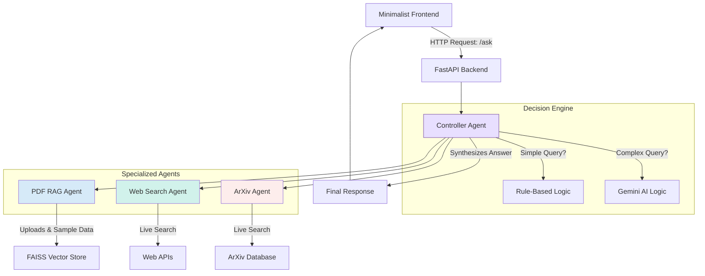

# Technical Report: Multi-Agentic System with Dynamic Decision Making

Applicant: [Your Name]
Date: 2025-10-07
For: Solar Industries India Limited - AIML Internship Assessment

---

## Executive Summary

This project implements a multi-agent AI system that routes user queries to specialized agents based on query characteristics. The system consists of a FastAPI backend, a minimal frontend interface, and three specialized agents: a PDF RAG agent for document retrieval, a web search agent for real-time information, and an ArXiv agent for academic papers.

The primary contribution of this work is the hybrid controller architecture. Rather than relying exclusively on LLM-based routing, the controller employs rule-based keyword matching for common query patterns and escalates to a Gemini language model for complex, ambiguous requests. This approach balances response latency with routing accuracy while minimizing API costs. The system includes comprehensive logging (traces.json), robust error handling, and domain-specific sample data for Solar Industries.

## System Architecture

The architecture follows a modular design pattern. User requests from the frontend are handled by the FastAPI backend, which delegates query processing to the Controller Agent. The controller analyzes the query, determines which agents should be invoked (potentially multiple), collects their responses, and synthesizes a unified answer.

## Controller Logic

The ControllerAgent implements a two-tier routing strategy. For straightforward queries, keyword-based pattern matching provides immediate routing decisions. Queries containing "latest news" invoke the Web Search agent; "research paper" triggers the ArXiv agent; "summarize pdf" directs to the RAG agent. This rule-based path executes in milliseconds.

Complex queries require more sophisticated handling. Consider the query "What are the latest market trends and academic papers on perovskite solar cells?" which involves multiple information sources. In such cases, the controller escalates to the Gemini language model with a prompt instructing it to act as a query router. The LLM returns a JSON specification such as `{"agents": ["Web Search", "ArXiv"]}`, and the controller invokes both agents accordingly. This hybrid approach provides computational efficiency for routine requests while maintaining intelligent routing for ambiguous cases.

All agents expose a uniform interface (`search()` or `retrieve()` methods), facilitating future extensibility.

## Development Challenges

The initial RAG implementation prioritized sample PDFs over recently uploaded user documents due to relying solely on vector similarity scoring. Since cosine similarity does not account for temporal relevance, the system frequently returned outdated content. This was addressed by augmenting document metadata with upload timestamps and implementing a re-ranking algorithm that boosts scores for recent uploads. The modification significantly improved retrieval accuracy.

The first controller iteration used only rule-based routing, which proved inadequate for multi-faceted queries such as "latest trends AND recent papers." Such queries require invoking multiple agents, which the simple if-statement logic could not handle. Integrating LLM-assisted routing resolved this limitation while maintaining fast execution for simple queries.

Early versions exhibited poor fault tolerance. When external APIs (SerpAPI, ArXiv) experienced downtime or rate limiting, the application would terminate with unhandled HTTPError exceptions. Wrapping all external calls in try-except blocks with appropriate fallback mechanisms (DuckDuckGo for search, mock responses for LLM failures) substantially improved system resilience.

Dependency management on Windows presented complications. Both faiss-cpu and PyMuPDF failed to install without Visual Studio build tools due to the absence of pre-compiled binary wheels. After investigating available package versions, specific versions with confirmed Windows wheel support (e.g., faiss-cpu==1.12.0) were pinned in requirements.txt. Python 3.12 demonstrated the best compatibility across dependencies.

## Design Decisions

FAISS was selected over Chroma for vector storage based on its performance characteristics and minimal configuration requirements. While Chroma offers built-in persistence capabilities, FAISS provides faster query execution and a smaller dependency footprint, which better suited the project's assessment scope.

The all-MiniLM-L6-v2 model from sentence-transformers was chosen for text embeddings. With a compact size of approximately 90MB and strong performance on semantic similarity tasks, it offers an appropriate balance between model quality and deployment simplicity.

PyMuPDF was selected for PDF text extraction due to its superior speed and accuracy compared to alternatives such as pdfminer.

## Sample Data

The system programmatically generates five sample PDFs on initial startup. Three documents cover general AI concepts (RAG fundamentals, multi-agent architectures, controller design patterns), while two provide Solar Industries-specific context: company operations and technology focus, and AI/ML applications in explosives manufacturing. This dual approach demonstrates both the system's general capabilities and its relevance to Solar Industries' domain.

## API Usage

The Google Gemini API free tier provides 15 requests per minute and 1 million tokens per minute, which is sufficient for demonstration purposes. The hybrid routing architecture minimizes LLM invocations since most queries are resolved via rule-based matching. Gemini API errors are logged and trigger fallback to mock responses to maintain application stability.

SerpAPI's free tier allows 100 searches per month. When this quota is exceeded or when no API key is configured, the system automatically falls back to DuckDuckGo's instant answer API, which requires no authentication.

## Security and Privacy

Uploaded PDFs undergo validation for file type and size (maximum 10MB) before being stored temporarily in the uploads/ directory. Following text extraction and chunking into the vector store, the original files are deleted. An automated cleanup task executes on application startup to remove any files older than 24 hours.

API credentials are loaded from a .env file, which is excluded from version control via .gitignore. No sensitive information is hard-coded in the codebase.

## Deployment

The project includes a Dockerfile for containerization and comprehensive deployment documentation (DEPLOYMENT.md) covering Hugging Face Spaces and Render platforms. All configuration parameters, including API keys and model selection, are managed through environment variables as documented in .env.example. Local setup instructions are provided in the README.

## Limitations

The FAISS vector index is rebuilt on each application restart, resulting in the loss of uploaded PDFs. While sample files regenerate automatically, user-uploaded documents do not persist. This limitation could be addressed through disk-based persistence or a database-backed vector store.

The system lacks user authentication and session management. All users share a single vector store, which is acceptable for demonstration purposes but unsuitable for production deployment. A production system would require OAuth or API key authentication along with isolated vector stores per user.

RAG retrieval is limited to the top 5 chunks per query, which may inadequately represent very long documents. The recursive chunking strategy with overlap partially mitigates this constraint.

The system depends on external APIs (Google Gemini, SerpAPI, ArXiv). Service degradation occurs when these APIs experience downtime or rate limiting, though graceful fallbacks are implemented (DuckDuckGo for search, mock responses for LLM failures with comprehensive error logging).

Initial startup latency ranges from 1-2 minutes due to sentence-transformers model download (approximately 90MB). This could be optimized by pre-caching the model in the Docker image. Additionally, embedding generation runs on CPU rather than GPU, resulting in typical query times of 200-500ms. Agent invocations occur sequentially rather than in parallel; implementing asyncio.gather() would likely reduce multi-agent request latency by 30-50%.

Security gaps include the absence of rate limiting, creating vulnerability to API abuse. While uploaded PDFs are deleted post-ingestion, their content remains in the vector store with no deletion mechanism short of server restart.

Scope limitations include text-only PDF support (scanned or image-heavy documents require OCR), English-only language optimization (Hindi or other Indian languages would require multilingual embedding models), and lack of multi-modal capabilities (images, audio, video would require additional models such as Gemini Vision).

## Future Enhancements

For production deployment at Solar Industries, several enhancements would provide substantial value. Response streaming would improve user experience by providing incremental feedback rather than requiring users to wait for complete answers. Token usage and cost tracking would enable LLM expenditure monitoring and budget management.

Fine-tuning the embedding model on Solar Industries' internal technical documentation would improve RAG accuracy for domain-specific terminology (e.g., "energetic materials," "detonator assembly"). Session management would enable multi-turn conversational interactions without requiring document re-upload between queries.

Vector store persistence and parallel agent execution represent implementation opportunities. Persistence would preserve uploaded documents across server restarts, while parallelization using asyncio.gather() would reduce multi-agent request latency by an estimated 30-50%.
