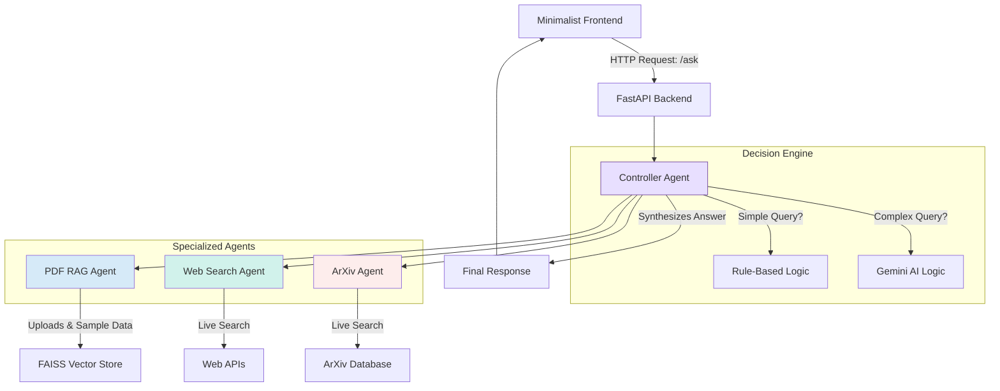

# Technical Report: Multi-Agentic System with Dynamic Decision Making

Applicant: [Your Name]
Date: 2025-10-07
For: Solar Industries India Limited - AIML Internship Assessment

---

## Overview

This project implements a multi-agent AI system that routes user queries to specialized agents. The system uses a FastAPI backend with a simple frontend, and includes three main agents: a PDF RAG agent for document Q&A, a web search agent for real-time information, and an ArXiv agent for academic papers.

The interesting part here is the controller logic. Instead of relying entirely on an LLM to decide everything, I built a hybrid system. Simple queries get routed through fast keyword-based rules, while complex ones escalate to a Gemini model. This keeps costs down and response times snappy. The whole thing logs extensively (to traces.json), handles errors gracefully, and includes sample data specific to Solar Industries to show domain relevance.

## Architecture

The design is straightforward. A frontend sends requests to the FastAPI backend, which immediately delegates to the Controller Agent. From there, the controller decides which agents to call (sometimes more than one), collects their responses, and synthesizes a final answer.

## Controller logic

The ControllerAgent makes routing decisions. For straightforward queries, it uses keyword matching—if someone asks about "latest news" it hits the Web Search agent; "research paper" triggers ArXiv; "summarize pdf" goes to RAG. Dead simple, runs in milliseconds.

Complex queries are different. Say someone asks "What are the latest market trends and academic papers on perovskite solar cells?" No single keyword matches. Here the controller hands the query to Gemini with a prompt that asks it to act as a router. The LLM returns JSON like `{"agents": ["Web Search", "ArXiv"]}` and the controller calls both. It's a nice balance—you get speed for routine stuff and intelligence for ambiguous requests.

Each agent exposes either a `search()` or `retrieve()` method. This makes adding new agents pretty easy down the road.

## What went wrong (and how I fixed it)

The RAG agent kept pulling results from the sample PDFs instead of what users just uploaded. Turns out vector similarity alone doesn't care about recency. I fixed this by adding timestamps to every document chunk and boosting scores for newer uploads. The retrieval got way better after that.

My first controller was just a bunch of if-statements. Worked fine for "latest news" but totally choked on queries like "latest trends AND recent papers." That's when I added the LLM fallback. Now simple stuff stays fast, complex stuff gets routed intelligently.

Then there was the fragility problem. Early on, if SerpAPI was down or rate-limited, the whole app would crash with an HTTPError. I wrapped everything in try-except blocks and added fallbacks. If one agent fails, the others keep running and we log the issue. Much more robust.

Oh, and dependency hell on Windows. faiss-cpu and PyMuPDF refused to install without Visual Studio build tools. I spent way too long on this before just pinning specific versions that had pre-built wheels (faiss-cpu==1.12.0, for example). Python 3.12 seems to have the best wheel support right now.

## Design choices

I went with FAISS over Chroma for the vector store. FAISS is fast, lightweight, and doesn't need much setup. Chroma has persistence out of the box, which is nice, but felt like overkill for an assessment project.

For embeddings I picked all-MiniLM-L6-v2 from sentence-transformers. It's only about 90MB and performs well enough for this use case. Deployment stays simple.

PyMuPDF handles PDF text extraction. It's faster than a lot of the other options (like pdfminer) and generally more accurate too.

## Sample data

The system generates 5 PDFs on first startup if they don't exist. Three cover general AI topics (RAG basics, multi-agent systems, controller design), and two are specific to Solar Industries: one about the company's products and technology focus, another about AI/ML applications in explosives manufacturing. This way the demo shows both general capability and domain relevance.

## API usage

Gemini's free tier gives you 15 requests per minute and 1 million tokens per minute, which is plenty for a demo. The hybrid routing helps here—most queries hit the rule-based path and never touch the LLM. When Gemini does error out, the system logs it and returns a mock response so nothing breaks.

SerpAPI has a 100 searches/month free tier. If that runs out (or if there's no key at all), the system falls back to DuckDuckGo's instant answer API, which doesn't need authentication.

## Security and privacy

Uploaded PDFs get validated (type and size check, max 10MB) and stored temporarily in uploads/. After the text gets extracted and chunked into the vector store, the file's deleted. There's also a cleanup task that runs on startup and removes anything older than 24 hours.

API keys come from a .env file, which is gitignored. No hard-coding secrets anywhere in the codebase.

## Deployment

There's a Dockerfile for containerization and a DEPLOYMENT.md with instructions for Hugging Face Spaces or Render. All config (API keys, model selection) goes through environment variables, which are documented in .env.example. The README has local setup instructions that should get you running in a few minutes.

## Limitations

The FAISS index rebuilds on every restart, so uploaded PDFs don't persist. Sample files regenerate automatically but custom uploads are lost. At some point this needs disk persistence or a database-backed store.

There's no user authentication. Everyone shares the same vector store. Fine for a demo, not acceptable for production. You'd want OAuth or API keys and isolated stores per user.

RAG only grabs the top 5 chunks per query. Long documents might not be fully represented, though the recursive chunking with overlap helps.

The system depends on external APIs (Gemini, SerpAPI, ArXiv). If they're down or rate-limited, we fall back gracefully but service degrades. DuckDuckGo covers search when SerpAPI fails; the LLM returns mock responses with error logs when Gemini's unavailable.

Performance-wise, first startup takes 1-2 minutes because sentence-transformers downloads a 90MB model. Could pre-cache this in the Docker image. Also, everything runs on CPU, so embeddings are slower than they'd be on GPU (200-500ms per query typically). Agents get called sequentially too, not in parallel. Using asyncio.gather() would speed up multi-agent requests by maybe 30-50%.

Security gaps: no rate limiting, so the API can be abused. PDFs get deleted after ingestion but stay in the vector store with no way to remove them except restarting the server.

Scope limitations are pretty clear. Text-only PDFs—scanned documents or image-heavy files won't work well without OCR. English-only too; Hindi or other Indian languages would need a multilingual embedding model. And there's no multi-modal support (images, audio, video). Gemini Vision could handle images eventually.

## What's next

For production at Solar Industries, a few enhancements would make sense. Response streaming would improve UX—seeing tokens appear one by one feels way more responsive than waiting for the full answer. Cost tracking is important too; without token usage monitoring you're flying blind on LLM spend.

Fine-tuning the embedding model on Solar's internal docs would boost RAG accuracy for domain jargon (think "energetic materials," "detonator assembly"). Session management would enable multi-turn conversations without re-uploading documents every time.

Vector store persistence and parallel agent execution are both straightforward wins. Persistence means uploads survive restarts; parallelization cuts multi-agent latency by 30-50% using asyncio.gather().
