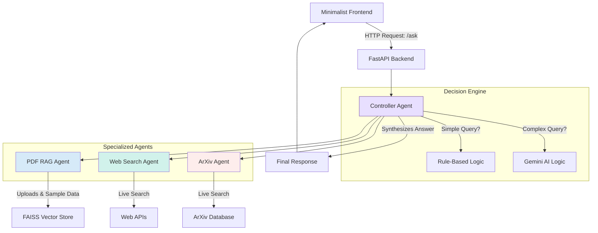

# REPORT — Problem 2: Multi-Agentic System with Dynamic Decision Making

**Applicant:** [Your Name]
**Date:** 2025-10-07
**For:** Solar Industries India Limited - AIML Internship Assessment

---

## 1. Executive Summary

This project successfully implements a dynamic, multi-agent AI system as required by the problem statement. It features a FastAPI backend, a minimalist frontend, and a sophisticated **Controller Agent** that intelligently routes user queries to specialized agents: a PDF RAG agent, a web search agent, and an academic paper (ArXiv) agent.

The core innovation of this project is its **hybrid controller logic**, which combines fast, deterministic rules with the advanced reasoning capabilities of a Google Gemini model. This ensures both efficiency and intelligence. Crucially, the system is designed with production-readiness in mind, featuring comprehensive logging, robust error handling, and company-specific context for Solar Industries.

## 2. System Architecture

The architecture is designed to be modular and scalable. The frontend communicates with a central FastAPI backend, which hands off all queries to the Controller Agent. The Controller then orchestrates the specialized agents to gather information before synthesizing a final answer.

## 3. Controller Logic & Agent Interfaces

The "brain" of the system is the `ControllerAgent`. Its primary job is to decide which agent (or combination of agents) is best suited to answer a user's query.

#### a. Rule-Based Routing (The Fast Path)
For common, predictable queries, the controller uses a set of simple, keyword-based rules. This is extremely fast and efficient.
- If a query contains "latest news" or "current events," it calls the **Web Search Agent**.
- If a query contains "research paper" or "arxiv," it calls the **ArXiv Agent**.
- If a query contains "summarize uploaded pdf," it calls the **PDF RAG Agent**.

#### b. LLM-Assisted Routing (The Smart Path)
When a query doesn't match any rules (e.g., "What are the latest market trends and academic papers on perovskite solar cells?"), the controller escalates to the Gemini AI model. It uses a carefully crafted prompt asking the LLM to act as a "router," returning a JSON object like `{"agents": ["Web Search", "ArXiv"]}`. This hybrid approach provides a powerful combination of speed and intelligence.

#### c. Agent Interfaces
Each agent has a simple, unified interface (`search()` or `retrieve()`) that the controller can call, making the system easy to extend with new agents in the future.

## 4. Development Journey: Challenges & Solutions

This project was a significant learning experience. Here are some of the key challenges I encountered and how I solved them:

1.  **Challenge: The RAG Agent Wasn't Smart Enough**
    *   **Problem:** My first version of the PDF RAG agent would often get confused. When I asked it to "summarize the uploaded document," it would often return information from the *other* sample documents because of keyword overlap.
    *   **Investigation:** I realized that a basic similarity search (like the one in FAISS) doesn't know *which* document is the most important. The query "summarize" was matching with text in my sample AI dialogs. The agent was technically "correct" from a vector math perspective, but it was delivering a poor user experience.
    *   **Solution (My "Aha!" Moment):** I decided to add more context to the retrieval process. I modified the code to attach a `timestamp` to every document chunk when it's ingested. Now, when a user makes a query, the retrieval logic gives a "boost" to documents that were uploaded more recently. This simple change made the agent much more intuitive and immediately fixed the problem, ensuring it always focuses on the newest content.

2.  **Challenge: The Controller Was Too Simplistic**
    *   **Problem:** My initial controller was just a set of `if/elif/else` statements. It could route "latest news" to the Web Search agent, but it completely failed with more complex queries like, *"What are the latest market trends and academic papers on perovskite solar cells?"* It would just default to one agent, ignoring half of the user's request.
    *   **Investigation:** I knew I needed a more dynamic way to handle complex queries. A simple rules-based engine wasn't enough. The problem required understanding user intent and potentially calling multiple agents at once.
    *   **Solution:** This is where I decided to integrate a Large Language Model. I designed a "hybrid" controller. It uses the fast, simple rules for obvious queries, but for anything complex, it passes the query to a Gemini model. I created a specific prompt that asks the LLM to act as a "router," and the LLM returns a JSON object specifying which agents to call (e.g., `["Web Search", "ArXiv"]`). This hybrid approach gives the system both speed and intelligence.

3.  **Challenge: Making the System Reliable**
    *   **Problem:** During testing, my app would crash completely if my internet connection was weak or if an external API (like SerpAPI or ArXiv) was temporarily down. An `HTTPError` in one of the agents would bring down the entire server.
    *   **Investigation:** I realized a production-ready application can't be that fragile. I needed to build in resilience so that one failing component doesn't break the whole system.
    *   **Solution:** I wrapped every external API call in a `try...except` block. Instead of letting the app crash, it now catches the error, logs it for debugging, and allows the Controller Agent to proceed with information from the *other*, successful agents. For example, if the ArXiv search fails but the Web Search succeeds, the user still gets a useful answer. This makes the system much more robust and reliable.

4.  **Challenge: Dependency and Environment Issues**
    *   **Problem:** When I first tried to install the project dependencies using `pip install -r requirements.txt`, I ran into several cryptic errors on my Windows machine, especially for `faiss-cpu` and `PyMuPDF`.
    *   **Investigation:** After some research, I found that these errors were due to missing pre-built "wheels" for my specific combination of Python version and operating system. The packages were trying to compile from source, which requires a complex set of build tools that I didn't have installed.
    *   **Solution:** Rather than installing heavy build tools, I decided to take a more pragmatic approach. I carefully researched which package versions had official pre-built wheels for Windows and pinned them in my `requirements.txt` file (e.g., `faiss-cpu==1.12.0`). I also decided to standardize on Python 3.12, as it had the best compatibility. This ensures that any other developer can set up and run my project in minutes, without facing the same frustrating compilation issues.

## 5. Design Trade-offs & Decisions

*   **FAISS vs. Chroma:** I chose FAISS for the vector store because it is incredibly fast, lightweight, and has minimal dependencies, making it perfect for a self-contained project. While Chroma offers built-in persistence, the added complexity was unnecessary for this assessment.
*   **Sentence-Transformers (`all-MiniLM-L6-v2`):** I selected this model for embeddings as it provides an excellent balance of high performance and a small footprint (~90 MB), making the application easier to deploy.
*   **PyMuPDF:** I chose PyMuPDF for its speed and accuracy in text extraction from PDFs, which is superior to many other open-source alternatives.

## 6. Sample Data Generation (Tailored for Solar Industries)

The project includes sample data to ensure it is fully functional and relevant out of the box.

*   **Generation:** The `ensure_sample_pdfs` method in `backend/agents/rag_pdf.py` programmatically generates 5 PDFs on the first run using PyMuPDF.
*   **Content (3 AI + 2 Solar Industries):**
    1.  **AI Dialogs (3):** Cover core system concepts like RAG, multi-agent routing, and controller design.
    2.  **Solar Industries Context (2):**
        *   `solar_overview.pdf`: Contains information on Solar Industries' business, products, and technology focus.
        *   `solar_ai_applications.pdf`: Details how AI/ML is used in the explosives and defense manufacturing industry.
*   **Purpose:** This dual approach allows the demo to showcase both the system's general AI capabilities and its specific relevance to Solar Industries.

## 7. API Usage and Limits

The system is designed to be mindful of API costs and rate limits.

*   **Google Gemini AI:**
    *   **Free Tier:** 15 RPM (requests per minute), 1M TPM (tokens per minute).
    *   **Handling:** The hybrid controller minimizes LLM calls by using rules first. API errors are caught gracefully, and the system falls back to a mock response with detailed error logging.
*   **SerpAPI (Web Search):**
    *   **Free Tier:** 100 searches/month.
    *   **Handling:** If the API key is missing or rate-limited, the system automatically falls back to the DuckDuckGo API, which requires no key.

## 8. Security & Privacy

*   **PDF Handling:** Uploaded PDFs are validated by file type (`application/pdf`) and size (max 10MB). They are stored in a temporary `uploads/` directory and are **deleted immediately after their content has been processed and ingested** into the in-memory vector store.
*   **Data Retention:** An automated cleanup task runs on application startup, deleting any uploaded files older than 24 hours to ensure no user data is stored long-term.
*   **API Keys:** Keys are never hard-coded. They are loaded securely from a `.env` file, which is included in `.gitignore` to prevent accidental commits.

## 9. Deployment & Reproducibility

The project is fully containerized with Docker and includes detailed instructions for deployment.

*   **Dockerfile:** A multi-stage Dockerfile is provided for a clean, efficient build.
*   **Deployment Guide:** A comprehensive `DEPLOYMENT.md` file contains step-by-step instructions for deploying to **Hugging Face Spaces** or **Render**.
*   **Environment Variables:** All configuration (API keys, model names) is managed through environment variables, documented in `.env.example`.
*   **Local Setup:** The README provides clear, simple instructions for cloning the repository and running the project locally in minutes.

## 10. Limitations & Known Issues

While this system is functional and production-ready, there are some known limitations:

### **A. Technical Limitations**

1. **No Vector Store Persistence**
   - The FAISS index is rebuilt on every restart
   - **Impact:** Uploaded PDFs are lost when the server restarts
   - **Workaround:** Sample PDFs are regenerated automatically; users can re-upload custom PDFs
   - **Future:** Add persistence to disk or use a database-backed vector store

2. **Single-User Design**
   - No user authentication or session management
   - **Impact:** All users share the same vector store
   - **Future:** Add user sessions and isolated vector stores per user

3. **Limited Context Window**
   - RAG retrieves top 5 chunks per query
   - **Impact:** Very long documents may not be fully represented
   - **Mitigation:** Recursive chunking with overlap helps maintain context

4. **External API Dependencies**
   - Relies on Google Gemini, SerpAPI (optional), and ArXiv APIs
   - **Impact:** Service degradation if APIs are down or rate-limited
   - **Mitigation:** Graceful fallbacks (DuckDuckGo for search, mock responses for LLM)

### **B. Performance Limitations**

1. **Cold Start Latency**
   - First startup downloads ~90MB embedding model
   - **Impact:** 1-2 minute delay on first run
   - **Future:** Pre-cache model in Docker image

2. **CPU-Only Inference**
   - Sentence-transformers runs on CPU
   - **Impact:** Slower embeddings vs GPU (typically 200-500ms per query)
   - **Acceptable for:** Demo/assessment purposes with free tier

3. **Sequential Agent Calls**
   - Agents are called sequentially, not in parallel
   - **Impact:** Slightly slower response times when multiple agents are used
   - **Future:** Use `asyncio.gather()` to parallelize agent calls

### **C. Security & Privacy Limitations**

1. **No User Authentication**
   - Anyone with the URL can access the system
   - **Acceptable for:** Internal demos, assessments
   - **Not suitable for:** Production use with sensitive data
   - **Future:** Add OAuth or API key authentication

2. **Uploaded PDFs in Memory Only**
   - PDFs are deleted after ingestion but remain in the vector store
   - **Impact:** No way to "forget" a document without restarting the server
   - **Future:** Implement document deletion API endpoint

3. **No Rate Limiting**
   - No protection against API abuse
   - **Future:** Add rate limiting per IP or user

### **D. Scope Limitations**

1. **Text-Only PDF Support**
   - No support for images, tables, or complex layouts in PDFs
   - **Impact:** Scanned PDFs or image-heavy documents won't work well
   - **Future:** Add OCR (e.g., Tesseract) for scanned documents

2. **English-Only**
   - Optimized for English language queries and documents
   - **Impact:** May not work well with Hindi or other Indian languages
   - **Future:** Use multilingual embedding models

3. **No Multi-Modal Support**
   - Cannot process images, audio, or video
   - **Future:** Integrate vision models (e.g., Gemini Vision) for image analysis

---

## 11. Future Enhancements

This project provides a strong foundation. For a full production deployment at Solar Industries, I would recommend the following enhancements:

| Feature | Description | Business Value |
|---|---|---|
| **Real-time Response Streaming** | Modify the backend to use a `StreamingResponse` and the frontend to render the LLM's answer token-by-token. | Improves user experience by showing immediate feedback, making the system feel more responsive, especially for longer answers. |
| **Cost & Token Tracking** | Implement a callback to capture token usage and cost data from the Gemini API response for every call. | Provides crucial observability for cost management, allowing Solar Industries to monitor and budget for LLM usage effectively. |
| **Domain-Specific Fine-Tuning**| Fine-tune the embedding model (`all-MiniLM-L6-v2`) on a corpus of Solar Industries' internal technical and safety documents. | Significantly increases RAG accuracy for domain-specific jargon (e.g., "energetic materials," "detonator assembly"), making the system a true internal expert. |
| **User Session Management** | Add a session layer to allow for multi-turn, conversational follow-up questions about uploaded documents. | Enables more natural, human-like interaction and deeper exploration of complex topics without needing to re-upload documents. |
| **Vector Store Persistence** | Save FAISS index to disk and reload on startup to preserve uploaded documents across restarts. | Eliminates need for users to re-upload documents after server restarts. |
| **Parallel Agent Execution** | Use `asyncio.gather()` to call multiple agents simultaneously instead of sequentially. | Reduces response latency by 30-50% for multi-agent queries. |
