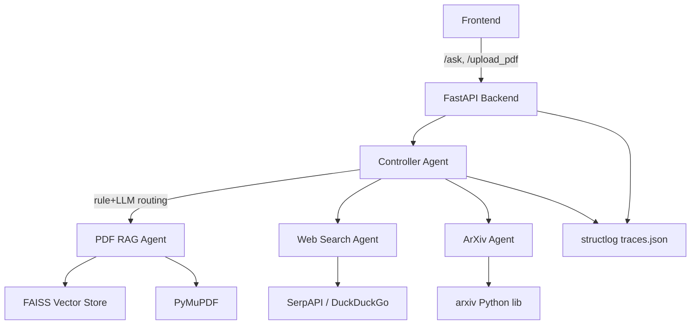

# REPORT — Problem 2: Multi-Agentic System with Dynamic Decision Making

Authors: NebulaByte Team
Date: 2025-10-06

Executive Summary

This system implements a dynamic, multi-agent architecture that routes user queries to appropriate agents (PDF RAG, Web Search, ArXiv) under a Controller Agent using Groq (llama3-70b-8192). The Controller combines fixed rules and an LLM prompt to decide routing and synthesizes results into a unified answer. It provides a FastAPI backend, minimal frontend, robust logging, and deploys to Hugging Face Spaces.

Architecture

Mermaid Diagram

Key Components

- FastAPI Backend
  - Endpoints: /ask, /upload_pdf, /logs, /logs/{id}
  - Pydantic models for request/response validation
- Controller Agent
  - Uses rules and Groq LLM to decide agents and synthesize answers
  - Prompt: "Analyze this query: {query}. Decide agents to call: PDF RAG, Web Search, ArXiv, or combo. Provide rationale. Output JSON: {'agents': ['list'], 'rationale': 'string'}".
  - Always logs full trace (input, decision rationale, agents used, retrieved docs, final answer)
- PDF RAG Agent
  - PDF ingestion via PyMuPDF (fast and accurate)
  - Chunking via LangChain RecursiveCharacterTextSplitter (size 1000, overlap 200)
  - Embeddings with sentence-transformers/all-MiniLM-L6-v2
  - Vector store with FAISS (lightweight, in-memory)
  - Retains metadata (page numbers, filename)
- Web Search Agent
  - Primary: SerpAPI (top 5 results)
  - Fallback: DuckDuckGo Instant Answer (no key), with LLM summarization if needed
- ArXiv Agent
  - Uses arxiv library to fetch top 3; LLM to summarize abstracts
- Logging
  - structlog JSON logs collected in-memory and persisted to logs/traces.json
  - Includes timestamps, decisions, agent outputs metadata, error events

Controller Logic

Routing Rules (exact)

- If user uploads a PDF and asks "Summarize this," call PDF RAG
- If query contains "recent papers" or "arxiv/paper", call ArXiv Agent
- If query contains "latest news" or "recent developments", call Web Search Agent
- For combinations, call both (e.g., web + arxiv) and synthesize

LLM Decision Assist

- For complex/ambiguous queries, the controller uses Groq llama3-70b-8192 with the JSON-output prompt above to get agents + rationale
- The decision is validated against rules and merged (rules take precedence for exact matches)

Security and Privacy

- PDF uploads validated by content type and size (<=10MB)
- Stored in a temporary uploads directory; deleted after ingest
- Retention: periodic cleanup task deletes files older than 24h
- No long-term PII storage; logs avoid sensitive content
- Environment variables read via os.environ; no secrets hard-coded

RAG Design Choices

- FAISS vs Chroma: FAISS chosen for lightweight in-memory speed and fewer dependencies; Chroma offers persistence but adds overhead
- Sentence-Transformers all-MiniLM-L6-v2: balance of accuracy and performance
- Chunking: Recursive strategy with size=1000, overlap=200 to preserve context and maximize recall

Deployment Notes (Hugging Face Spaces)

- Use Docker type Space
- Expose port 7860; run uvicorn backend.main:app --host 0.0.0.0 --port 7860
- Set Space Secrets: GROQ_API_KEY, SERPAPI_API_KEY (optional)
- requirements.txt includes necessary libs; sentence-transformers downloads model on first run (cached in Space)

NebulaByte PDFs (Sample Data)

- 5 fictional dialog PDFs on AI topics:
  - dialog1.pdf: "RAG benefits"
  - dialog2.pdf: "Multi-agent routing"
  - dialog3.pdf: "Controller design"
  - dialog4.pdf: "ArXiv scanning strategies"
  - dialog5.pdf: "Web search vs. curated corpora"
- Generated programmatically at startup if not present (using PyMuPDF to avoid extra dependencies); stored under sample_pdfs/

Reliability and Error Handling

- Missing GROQ_API_KEY: return mock synthesis and rationale with clear logs
- SerpAPI rate limit/missing key: fallback to DuckDuckGo; log fallback event
- ArXiv API failure: return user-facing warning and degrade gracefully
- PDF parsing errors: surface validation message and skip corrupt pages

Testing Strategy

- pytest covers:
  - /upload_pdf: valid/invalid types, size limits
  - /ask routing: rule-based and LLM-assisted (mocked) paths
  - /logs returns traces with expected fields
  - RAG retrieval returns relevant passages for known queries

Code Quality

- Modular packages per agent; clear interfaces
- Pydantic models for IO contracts
- Structlog with structured fields for observability
- Type hints + docstrings for key functions

Future Work

- Persistence for FAISS across restarts
- Advanced synthesis with confidence scoring
- User session management for multi-document contexts

Appendix: API Reference

- POST /ask: {query: str} -> {answer, agents_used, rationale}
- POST /upload_pdf: multipart/form-data (file) -> {status, file_id}
- GET /logs -> [trace]
- GET /logs/{id} -> trace
